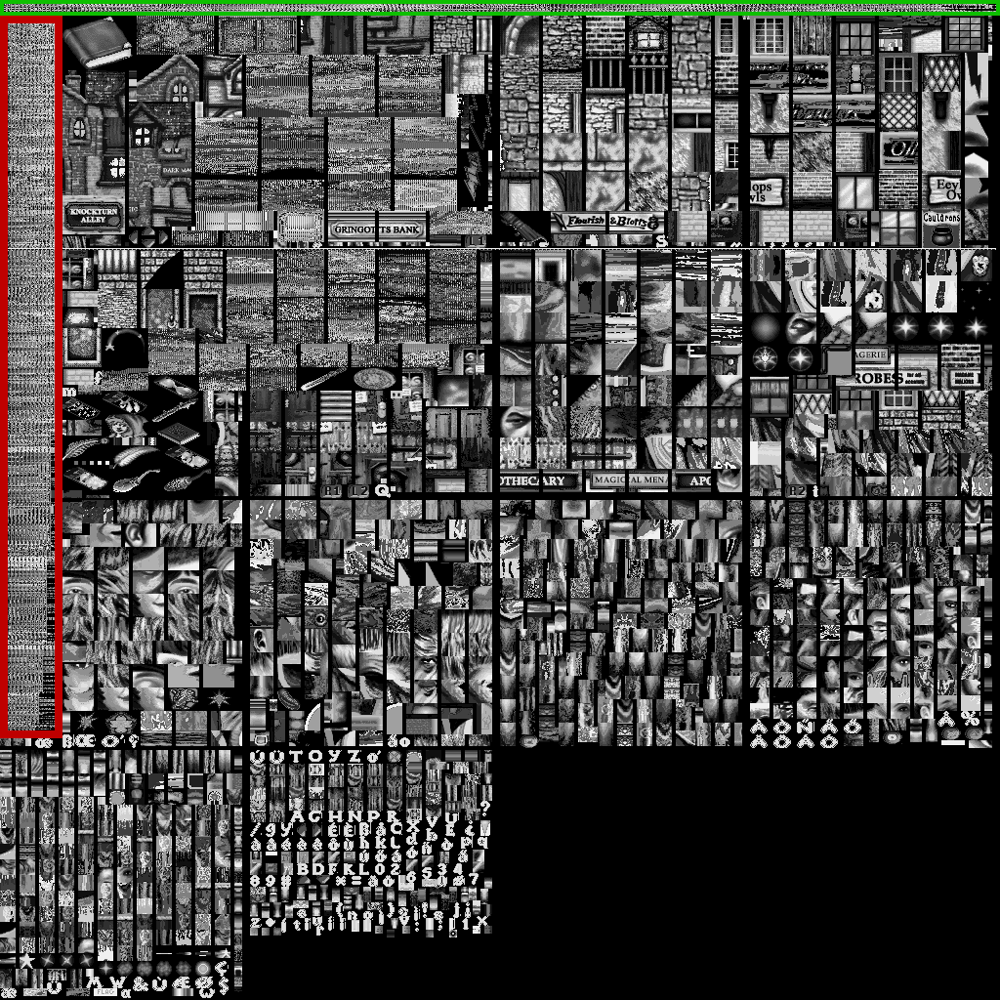

# Textures format

Structure detailed in [XSPT documentation](../WAD%20sections/XSPT.md).

The texture format is pretty complex, I tried to document it the best I could.  
Contact me if you need help understanding it.

## BRender's textures concepts

In order to understand how BRender textures work, I advise you to read this part of the documentation.

### General concept

The raw textures data is a mix of color palettes, paletted textures with multiple palette sizes and non-paletted textures.  
I coded functions that display all textures on the same image, but textures are originally meant to be extracted individually, following this process:

1. Extracting specific bytes, based on the x,y texture coordinates
2. Applying them palette colors if needed

### RLE compression

In all games (except Croc 2 Demo dummy WADs), the raw texture data is compressed with 16-bit/2 bytes RLE.  
A positive run means "copy as is the 2 × n-th next bytes", a negative run means "copy n-th times the next 2 bytes".

### Legacy textures

Some texture files contain legacy textures from Croc games (I've only seen these in T1L1M001 WADs of several games).   
This is the case when the 3rd bit of the [XSPT flags](../WAD%20sections/XSPT.md#XSPT-flags-structure) is set.
Legacy textures are composed of 5 uncompressed textures (256-colors paletted) of 0xC00 long each (64 pixels wide).

### Color information storage techniques

So far, I encountered 3 different types of color storage techniques, divided into 2 categories:
- Not using a color palette:
    1. [15-bit high color](#15-bit-high-color) (16bit/pixel): Mainly used for storing the colors inside the palettes. Used by a few textures.
- Using a color palette:
    2. [16-color palettes](#16-color-palettes) (4bit/pixel): Used by the vast majority of the textures.
    3. [256-color palettes](#256-color-palettes) (8bit/pixel): Used by some textures requiring a lot of different colors (sky textures for example).

#### 15-bit high color

On your hex editor, the bits are in this order (R for Red, G for Green, B for Blue, T for the transparency bit):  
```
| 07 06 05 04 03 02 01 00 | 15 14 13 12 11 10 09 08 |  
| G  G  G  R  R  R  R  R  | T  B  B  B  B  B  G  G  |
```
> LSB = Less Significant Bit, MSB = Most Significant Bit

|Bit|Usage|Notes|
|:---|:---|:---|
|0-4|Red component|4th bit is the MSB, 0th bit is the LSB|
|5-9|Green component|9th bit is the MSB, 5th bit is the LSB|
|10-14|Blue component|14th bit is the MSB, 10th bit is the LSB|
|15|Transparency bit OR null<sup>1</sup>|If all bits, including this one, are not set, the color is transparent. If this bit is the only one set, the color is black|

<sup>1</sup> : If the color is from a 256-color palette, this bit is unused.

#### Palettes

The following image is a visual representation of the Diagon Alley's texture file (4 bit/pixel, no palette applied, 1024x1024 px image, so 512 bytes/line).

> There is an horizontal line on the 255th and 256th lines that looks like this:
> ─┬──┬──┬──┬──┬──┬─  
> This *could* mean that the texture file was originally limited to 1024x256 pixels with 4 bit/pixel.

##### 256-color palettes

The green area contains the 256-color palettes.
[One color takes 2 bytes](#15-bit-high-color), so a complete palette takes 512 bytes, that is a complete line.
Note that the transparency bit is not used by this type of palette (See [15-bit high color](#15-bit-high-color)).  
Textures that use 256-color palettes take 8 bits per pixel.

##### 16-color palettes

The red area contains the 16-color palettes. One color still takes 2 bytes, so a complete palette takes 32 bytes, but as there is only one palette per 512 bytes, the rest of the line is used by textures.  
Textures that use 16-color palettes take 4 bits per pixel.

> There can be textures inside palettes zones. This occurs when contiguous palettes aren't full and there is room for a texture inside those unused bytes.



## Textures header structure

|Offset (h)|Size (h)|Use|Notes|
|:---|:---|:---|:---|
|0x0|0x4|Textures count|Abbreviated to 'tc'|
|0x4|0x4|Texture file rows count|Each row is 256-pixel large (4 rows / 1024 px max)|
|0x8|0xC × 'tc'|[Texture descriptors](#Texture-descriptor-structure)|In Harry Potter, the 16 last texture descriptors are blank|
|+0x0|0x4|**UNKNOWN**|Unknown count, can be 0. Abbreviated to 'uc'|
|+0x4|0x4|**UNKNOWN**||
|+0x8|0x4 × *uc*|**UNKNOWN**|Can be nonexistent if *uc* == 0
|++0x0|0x0 or 0x3C00|Legacy textures|Nonexistent if the 3rd flags bit is not set, else 0x3C00 long. See [Legacy textures](#Legacy-textures)|
|+++0x0|Until the end of XSPT|Raw textures data|Is compressed in most games, see [RLE compression](#RLE-compression)|


## Texture descriptor structure

|Offset (h)|Size (h)|Usage|Notes|
|:---|:---|:---|:---|
|0x0|0x1|x ┬ Image coordinates of the 1st point||
|0x1|0x1|y ┘||
|0x2|0x2|Color palette information|See [Color palette information bit by bit structure](#Color-palette-information-bit-by-bit-structure)|
|0x4|0x1|x ┬ Image coordinates of the 2nd point||
|0x5|0x1|y ┘||
|0x6|0x2|Texture flags|See [Texture flags bit by bit structure](#Texture-flags-bit-by-bit-structure)|
|0x8|0x1|x ┬ Image coordinates of the 3rd point||
|0x9|0x1|y ┘||
|0xA|0x1|x ┬ Image coordinates of the 4th point||
|0xB|0x1|y ┘||

The points seems to follow the same pattern as 3D models faces' vertices, see [3D Models#Quadrilaterals vertices order](3D%20models.md#Quadrilaterals-vertices-order).

### Color palette information bit by bit structure

Those bits hold information about color palettes, mainly their location.

On your hex editor, the bits are in this order:  
`| 07 06 05 04 03 02 01 00 | 15 14 13 12 11 10 09 08 |`

> LSB = Less Significant Bit, MSB = Most Significant Bit

|Bit|Usage|Notes|
|:---|:---|:---|
|0-3|Horizontal shift of the palette's start|2th bit is the MSB, 0th bit is the LSB. +1 on this value means +32 bytes or +16 pixels towards the right (on a 256-pixel wide true color representation). I've never seen these bits set|
|4|**UNKNOWN**|This bit is identical to the 15th bit, that is the MSB of the vertical shift (weight: 512)|
|5|**UNKNOWN**|All textures seem to have this bit set (except unpaletted ones)|
|6-15|Vertical shift of the palette's start|15th bit is the MSB, 6th bit is the LSB. +1 on this value means +512 bytes or +1 pixel downwards (on a 256-pixel wide true color representation)|

### Texture flags bit by bit structure

The row and column numbers are stored with 2 bits each. The row number's bits are arranged in a bizarre way, this is not a typo.

On your hex editor, the bits are in this order:  
`| 07 06 05 04 03 02 01 00 | 15 14 13 12 11 10 09 08 |`

> LSB = Less Significant Bit, MSB = Most Significant Bit

|Bit|Usage|Notes|
|:---|:---|:---|
|0|LSB of column number|See [Row & columns bits](#Rows--columns-bits)|
|1|MSB of column number||
|2|**MSB** of row number||
|3|**UNKNOWN**|All textures seem to have this bit set (except unpaletted ones)|
|4|**LSB** of row number||
|5|**UNKNOWN**|Most textures have this bit set|
|6|**UNKNOWN**|Seems to be set on textures that aren't displayed "all the time". For example, for animated textures, for a spell that needs to be learned beforehand, etc.|
|7|If set, the texture uses a 256-color palette, else it uses a 16-color palette|See [Palettes](#Palettes)|
|8|If set, the texture uses no palette, all pixels are unpaletted 15-bit color pixels|See [15-bit high color](#15-bit-high-color)|
|9-15|∅ Empty|(As far as I know)|

#### Rows & columns bits

This table represents the link between row & column bits and the associated texture's zone.

|||||
|:---:|:---:|:---:|:---:|
| | |1st<br>bit|<pre>0      0      1      1</pre>|
| | |0th<br>bit|<pre>0      1      0      1</pre>|
|2nd bit|4th bit| | |
|<pre>0<br><br><br>0<br><br><br>1<br><br><br>1</pre>|<pre>0<br><br><br>1<br><br><br>0<br><br><br>1</pre>| ||
